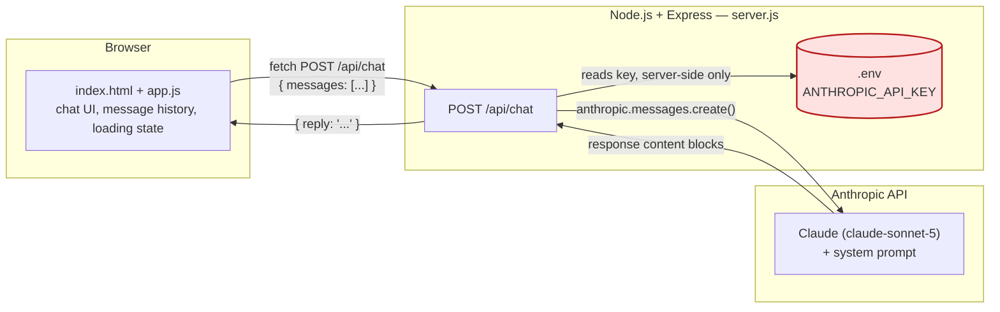

# School Admissions & Marketing Assistant

An AI-powered chat assistant for a school's admissions and marketing workflows, built as
a standalone Node.js + Express application powered by Anthropic's Claude API.

It helps three kinds of people:

- **Prospective parents** — questions about programmes, admissions, application
  requirements, campus visits, and general FAQs.
- **Admissions officers** — the same, plus help drafting replies to enquiries.
- **Marketing staff** — drafting parent emails, website copy, social media captions,
  event announcements, and follow-up messages.

This is a self-contained project — separate from the Tulip Events Registration Tool and
the Barry bot elsewhere in this repository.

---

## Features

- Clean, professional chat interface with conversation history
- Loading indicator while waiting for a response
- Responsive layout (mobile to desktop)
- A system prompt that keeps the assistant on-topic, professional, and honest about
  what it doesn't know (no invented fees, dates, or policies — placeholders instead)
- The Anthropic API key never leaves the server — the browser only ever talks to this
  app's own `/api/chat` endpoint

---

## Architecture



**Key boundary:** the API key (red box above) is read only inside `server.js`, on the
server side of the HTTP boundary. The browser never receives it, never stores it, and
has no code path that could expose it — it only ever calls this app's own `/api/chat`
endpoint over `fetch()`.

### Request flow

1. User types a message and clicks **Send** (or presses Enter).
2. `app.js` appends the message to the in-memory conversation array and `POST`s the
   *entire* conversation so far to `/api/chat`.
3. `server.js` validates the payload, attaches the system prompt, and calls the
   Anthropic Messages API using the key from `.env`.
4. The assistant's reply is extracted from the response and sent back as
   `{ reply: "..." }` — nothing else from the Anthropic response is forwarded.
5. `app.js` appends the reply to the conversation and renders it as a chat bubble.

---

## Tech stack

| Layer | Technology |
|---|---|
| Backend | Node.js, Express |
| AI | Anthropic Claude API (`@anthropic-ai/sdk`) |
| Frontend | Static HTML/CSS/vanilla JavaScript — no framework, no build step |
| Config | `dotenv` |

---

## Project structure

```
school-admissions-assistant/
├── server.js           # Express server + /api/chat endpoint (only file that reads the API key)
├── package.json
├── .env.example        # Template for required environment variables
├── .env                # Your real API key — created locally, never committed
├── .gitignore          # Excludes node_modules/ and .env
├── public/
│   ├── index.html      # Chat page
│   ├── styles.css      # Styling
│   └── app.js          # Client-side chat logic
└── README.md
```

---

## Setup

```bash
npm install
cp .env.example .env
# then edit .env and add your real Anthropic API key
npm start
```

Visit `http://localhost:3000`.

---

## Environment variables

| Variable | Required | Description |
|---|---|---|
| `ANTHROPIC_API_KEY` | Yes | Your Anthropic API key. The server refuses to start without it. |
| `PORT` | No (defaults to `3000`) | Port the Express server listens on. |

---

## Security notes

- `.env` is gitignored in this folder specifically, on top of the repo's root
  `.gitignore` — verified with `git check-ignore`, not just assumed.
- The server fails fast and loudly if `ANTHROPIC_API_KEY` is missing, rather than
  starting in a broken state.
- User input is HTML-escaped before being rendered in the browser to avoid XSS.
- The system prompt explicitly instructs the assistant never to invent specific facts
  (fees, dates, policies) — it's told to say so plainly or use a placeholder instead.

---

## Known limitations

- Conversation history lives only in the browser tab's memory — refreshing the page
  clears it. No persistence layer exists (none was required).
- No authentication, rate limiting, or multi-user support — this is a local,
  single-user demo app.
- No automated test suite.
